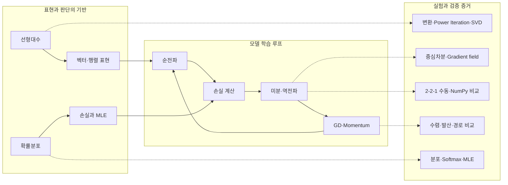

# Model Learning Mechanics Lab

NumPy로 AI 학습의 수학적 기반을 직접 계산하고 Matplotlib으로 시각화한 실습 프로젝트입니다. 선형변환과 행렬 분해, 수치미분, 연쇄 법칙 기반 역전파, Gradient Descent, 확률분포와 손실 함수의 MLE 해석을 다룹니다.

## 한눈에 보는 학습 지도

이 프로젝트는 **데이터와 파라미터를 표현하고, 예측 오차를 측정한 뒤, gradient로 파라미터를 개선하는 과정**을 하나의 학습 루프로 연결합니다.



| 인지적 질문 | 연결되는 개념 | 이 프로젝트에서 확인하는 것 |
|---|---|---|
| 무엇으로 표현하는가? | 벡터, 행렬, 선형변환, 고유값, SVD | 공간 변환, 주 고유쌍, 저랭크 복원 |
| 오차의 변화는 어떻게 아는가? | 수치미분, gradient, 연쇄 법칙 | 중심차분 정확도, gradient 방향, 역전파 shape |
| 파라미터를 어떻게 개선하는가? | Vanilla GD, Momentum | 학습률별 수렴·발산과 최적화 경로 |
| 어떤 기준으로 예측을 평가하는가? | 확률분포, MLE, MSE, Cross-Entropy | 분포-손실 연결과 안정적 Softmax |
| 결과를 어떻게 믿을 수 있는가? | 기준 계산, 수치 오차, 테스트, 시각화 | NumPy 기준값 비교, 재현 로그, PNG 산출물 |

## 주요 결과

| 항목 | 검증 결과 |
|---|---|
| 중심차분, $f(x)=x^2$, $x=3$ | $6.0000000000$ (절대오차 $<10^{-4}$) |
| Power Iteration, $A=[[4,1],[1,3]]$ | $\lambda=4.618034$, $v=[0.850650,0.525732]$ |
| 스케일 변환 $S(2,0.5)$ | $|\det(S)|=1.0$, 면적비 $=1.0$, 오차 $=0\%$ |
| Vanilla GD, lr=0.1, 100회 | 최종 반경 $1.44\times10^{-9}<0.1$ |
| 타원형 함수, 60회 | Vanilla 손실 $2.2134$, Momentum 손실 $0.3327$ |
| 안정적 Softmax | 출력 합 $0.9999999999999999$ |

## 프로젝트 구조

```text
src/
  linear_algebra.py   # 행렬 변환, Power Iteration, SVD
  calculus.py         # 중심차분, 수치 gradient, 등고선 시각화
  optimizer.py        # VanillaGD, Momentum, 최적화 경로
  probability.py      # 정규·베르누이 분포, Softmax
notebooks/
  backprop_derivation.ipynb
  probability_loss.ipynb
scripts/
  generate_outputs.py
tests/
outputs/
```

## 설치 및 실행

Python 3.8 이상이 필요합니다.

```bash
python3 -m venv .venv
source .venv/bin/activate
pip install -r requirements.txt
```

전체 테스트를 실행합니다.

```bash
MPLBACKEND=Agg python3 -m pytest -v
```

모든 PNG 결과를 같은 입력과 seed로 다시 생성합니다.

```bash
MPLBACKEND=Agg python3 scripts/generate_outputs.py
```

노트북의 계산과 출력도 처음부터 재실행할 수 있습니다.

```bash
jupyter nbconvert --to notebook --execute --inplace notebooks/backprop_derivation.ipynb --ExecutePreprocessor.record_timing=False
jupyter nbconvert --to notebook --execute --inplace notebooks/probability_loss.ipynb --ExecutePreprocessor.record_timing=False
```

## 실험 설명

### 선형대수

점 집합은 `(2, n)` 열벡터로 표현합니다. 회전, 스케일, 전단 행렬을 단위 원에 적용하고 변환 전후를 겹쳐 그립니다. 신발끈 공식으로 구한 면적비와 $|\det(A)|$를 비교합니다.

Power Iteration은 매 반복마다 $Av$를 정규화하고 Rayleigh quotient $v^TAv$로 최대 고유값을 추정합니다. 아래 재현 스크립트는 `np.linalg.eig`로 기준 고유쌍을 별도로 계산하고, 고유값 절대오차와 부호 불변 고유벡터 정렬도/L2 오차를 출력합니다.

```text
$ MPLBACKEND=Agg python3 scripts/generate_outputs.py
...
Power Iteration vs np.linalg.eig
matrix = [[4.0, 1.0], [1.0, 3.0]]
power eigenvalue     = 4.618033988750
numpy eig eigenvalue = 4.618033988750
eigenvalue abs error = 8.882e-16
power eigenvector     = [0.85065081 0.52573111]
numpy eig eigenvector = [0.85065081 0.52573111]
eigenvector alignment = 1.000000000000
eigenvector L2 error  = 5.590e-10
iterations            = 30
```

SVD 압축은 $A\approx U_k\Sigma_kV_k^T$로 복원합니다. 명시된 `k=100`을 실험하려면 최소 한 변의 길이가 100 이상이어야 하므로, 참고 가이드의 64×64 대신 결정론적으로 생성한 128×128 grayscale 이미지를 사용합니다.

### 미적분과 역전파

중심차분은 다음 식을 사용합니다.

$$f'(x)\approx\frac{f(x+h)-f(x-h)}{2h}$$

$f(x,y)=x^2+y^2$의 등고선 위에 $\nabla f=[2x,2y]$ 방향을 표시합니다. [역전파 노트북](notebooks/backprop_derivation.ipynb)은 고정된 2-2-1 신경망의 순전파와 모든 필수 기울기를 shape과 함께 손계산하고 NumPy 결과와 소수점 넷째 자리까지 비교합니다.

### 최적화

Vanilla GD와 Momentum 모두 초기점을 포함한 전체 parameter path를 저장합니다. $f(x,y)=x^2+y^2$에서 업데이트 계수는 $1-2\,lr$입니다. 따라서 `lr=0.5`는 한 번에 원점에 도달하며 발산하지 않습니다. `lr≥0.5` 구간에서 실제 발산을 보여 주기 위해 $|1-2\,lr|>1$인 `lr=1.1`을 사용합니다.

타원형 함수 $f(x,y)=x^2+10y^2$에서는 같은 초기점 `[5,5]`, `lr=0.01`, 60회 조건으로 두 옵티마이저를 비교합니다.

### 확률과 손실 함수

[확률 노트북](notebooks/probability_loss.ipynb)은 $N(0,1)$과 $N(2,0.5)$, $B(0.3)$과 $B(0.7)$을 비교하고 다음 연결을 단계별로 유도합니다.

- 일정한 분산의 정규 오차 가정: MSE 최소화 = Gaussian MLE
- 베르누이/카테고리 가정: Cross-Entropy 최소화 = Bernoulli/Categorical MLE

Softmax는 exponentiation 전에 최대 logit을 빼서 큰 입력에서도 overflow를 방지합니다.

## 결과 갤러리

### 행렬 변환과 SVD


### Gradient와 최적화


### 확률분포


