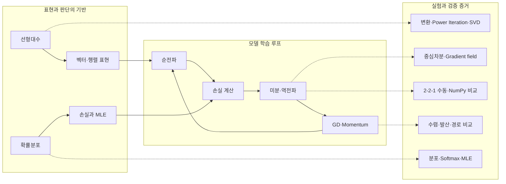
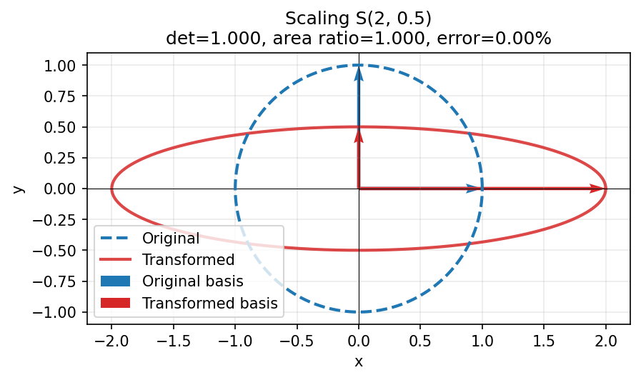
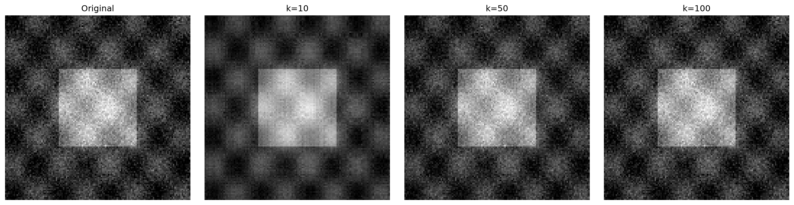
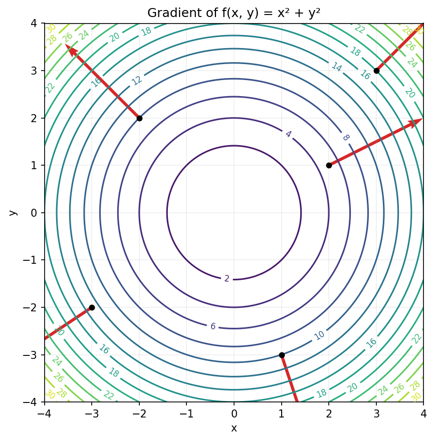
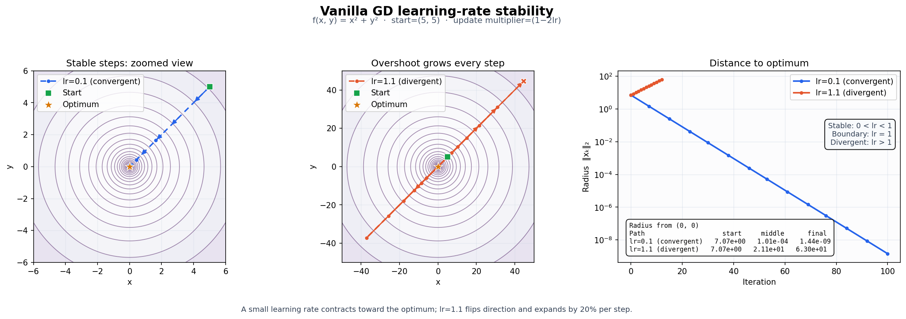
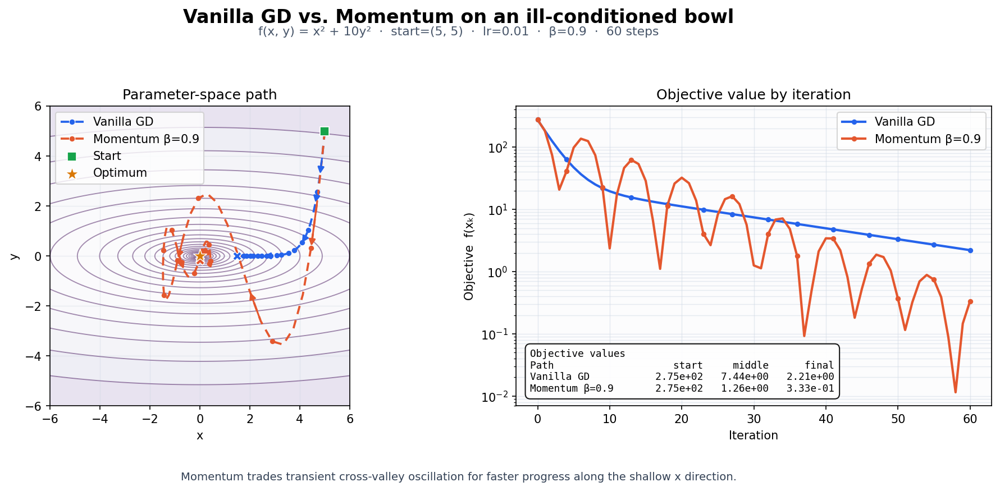
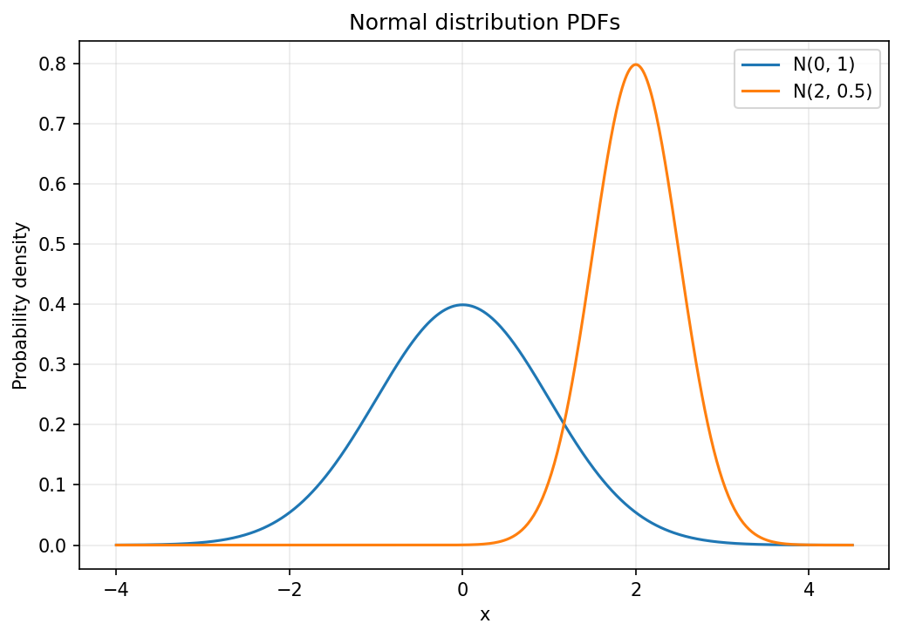
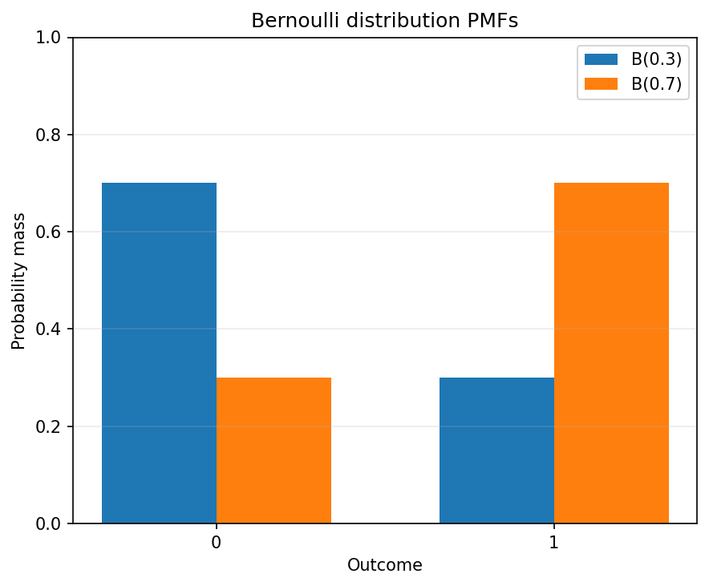

# Model Learning Mechanics Lab

NumPy로 AI 학습의 수학적 기반을 직접 계산하고 Matplotlib으로 시각화한 실습 프로젝트입니다. 선형변환과 행렬 분해, 수치미분, 연쇄 법칙 기반 역전파, Gradient Descent, 확률분포와 손실 함수의 MLE 해석을 다룹니다.

## 한눈에 보는 학습 지도

이 프로젝트는 **데이터와 파라미터를 표현하고, 예측 오차를 측정한 뒤, gradient로 파라미터를 개선하는 과정**을 하나의 학습 루프로 연결합니다.



| 인지적 질문 | 연결되는 개념 | 이 프로젝트에서 확인하는 것 |
|---|---|---|
| 무엇으로 표현하는가? | 벡터, 행렬, 선형변환, 고유값, SVD | 공간 변환, 주 고유쌍, 저랭크 복원 |
| 오차의 변화는 어떻게 아는가? | 수치미분, gradient, 연쇄 법칙 | 중심차분 정확도, gradient 방향, 역전파 shape |
| 파라미터를 어떻게 개선하는가? | Vanilla GD, Momentum | 학습률별 수렴·발산과 최적화 경로 |
| 어떤 기준으로 예측을 평가하는가? | 확률분포, MLE, MSE, Cross-Entropy | 분포-손실 연결과 안정적 Softmax |
| 결과를 어떻게 믿을 수 있는가? | 기준 계산, 수치 오차, 테스트, 시각화 | NumPy 기준값 비교, 재현 로그, PNG 산출물 |

## 주요 결과

| 항목 | 검증 결과 |
|---|---|
| 중심차분, $f(x)=x^2$, $x=3$ | $6.0000000000$ (절대오차 $<10^{-4}$) |
| Power Iteration, $A=[[4,1],[1,3]]$ | $\lambda=4.618034$, $v=[0.850650,0.525732]$ |
| 스케일 변환 $S(2,0.5)$ | $|\det(S)|=1.0$, 면적비 $=1.0$, 오차 $=0\%$ |
| Vanilla GD, lr=0.1, 100회 | 최종 반경 $1.44\times10^{-9}<0.1$ |
| 타원형 함수, 60회 | Vanilla 손실 $2.2134$, Momentum 손실 $0.3327$ |
| 안정적 Softmax | 출력 합 $0.9999999999999999$ |

## 프로젝트 구조

```text
src/
  linear_algebra.py   # 행렬 변환, Power Iteration, SVD
  calculus.py         # 중심차분, 수치 gradient, 등고선 시각화
  optimizer.py        # VanillaGD, Momentum, 최적화 경로
  probability.py      # 정규·베르누이 분포, Softmax
notebooks/
  backprop_derivation.ipynb
  probability_loss.ipynb
scripts/
  generate_outputs.py
  verify_linear_algebra.py  # 면적비·고유값 오차 기준 콘솔 검증
tests/
outputs/
```

## 설치 및 실행

Python 3.8 이상이 필요합니다.

```bash
python3 -m venv .venv
source .venv/bin/activate
pip install -r requirements.txt
```

전체 테스트를 실행합니다.

```bash
MPLBACKEND=Agg python3 -m pytest -v
```

모든 PNG 결과를 같은 입력과 seed로 다시 생성합니다.

```bash
MPLBACKEND=Agg python3 scripts/generate_outputs.py
```

면적비와 Power Iteration 고유값의 제출 기준을 콘솔에서 확인합니다.

```bash
python3 scripts/verify_linear_algebra.py
```

노트북의 계산과 출력도 처음부터 재실행할 수 있습니다.

```bash
jupyter nbconvert --to notebook --execute --inplace notebooks/backprop_derivation.ipynb --ExecutePreprocessor.record_timing=False
jupyter nbconvert --to notebook --execute --inplace notebooks/probability_loss.ipynb --ExecutePreprocessor.record_timing=False
```

## 실험 설명

### 선형대수

점 집합은 `(2, n)` 열벡터로 표현합니다. 회전, 스케일, 전단 행렬을 단위 원에 적용하고 변환 전후를 겹쳐 그립니다. 신발끈 공식으로 구한 면적비와 $|\det(A)|$를 비교합니다.

Power Iteration은 매 반복마다 $Av$를 정규화하고 Rayleigh quotient $v^TAv$로 최대 고유값을 추정합니다. 아래 전용 검증 스크립트는 면적비와 $|\det(A)|$의 상대오차가 1% 이내인지, Power Iteration 고유값과 `np.linalg.eig` 기준값의 상대오차가 5% 이내인지를 각 섹션의 기준과 수치로 출력합니다.

```text
$ python3 scripts/verify_linear_algebra.py
Linear algebra verification

[1] Area ratio vs |det(A)| (relative error <= 1.00%)
matrix               = [[3.0, 0.0], [0.0, 0.5]]
det(A)               = 1.500000000000
|det(A)|             = 1.500000000000
measured area ratio  = 1.500000000000
relative error       = 0.000000%

[2] Power Iteration vs np.linalg.eig (relative error <= 5.00%)
matrix = [[4.0, 1.0], [1.0, 3.0]]
power eigenvalue     = 4.618033988750
np.linalg.eig value  = 4.618033988750
eigenvalue abs error = 8.882e-16
relative error       = 0.000000%
iterations            = 30
```

SVD 압축은 $A\approx U_k\Sigma_kV_k^T$로 복원합니다. 명시된 `k=100`을 실험하려면 최소 한 변의 길이가 100 이상이어야 하므로, 제출한 입력 이미지는 `assets/images/svd_source.png`에 두고 grayscale로 변환해 사용합니다.

### 미적분과 역전파

중심차분은 다음 식을 사용합니다.

$$f'(x)\approx\frac{f(x+h)-f(x-h)}{2h}$$

$f(x,y)=x^2+y^2$의 등고선 위에 $\nabla f=[2x,2y]$ 방향을 표시합니다. [역전파 노트북](notebooks/backprop_derivation.ipynb)은 고정된 2-2-1 신경망의 순전파와 모든 필수 기울기를 shape과 함께 손계산하고 NumPy 결과와 소수점 넷째 자리까지 비교합니다.

### 최적화

Vanilla GD와 Momentum 모두 초기점을 포함한 전체 parameter path를 저장합니다. 아래에서 $\eta$는 코드의 `learning_rate`입니다.

#### 구형 함수: $f(x,y)=x^2+y^2$

두 축의 업데이트 계수는 모두 $1-2\eta$입니다.

| 학습률 $\eta$ | 경로의 성질 |
|---|---|
| $0<\eta<0.5$ | 부호를 바꾸지 않고 안정적으로 원점에 수렴한다. `η=0.1`이 여기에 해당한다. |
| $\eta=0.5$ | 한 step에 정확히 원점(최적점)에 도달한다. |
| $0.5<\eta<1$ | 원점을 넘나들며 진동하지만, 진폭은 줄어들어 수렴한다. |
| $\eta=1$ | 원점을 사이에 두고 진폭을 유지한다. |
| $\eta>1$ | 원점을 넘나들며 진폭이 커져 발산한다. `η=1.1`을 그림으로 확인한다. |

#### 타원형 함수: $f(x,y)=x^2+10y^2$

업데이트 계수는 x축이 $1-2\eta$, y축이 $1-20\eta$입니다. 즉 y축의 곡률이 10배 커서 안정적으로 수렴하려면 $0<\eta<0.1$이어야 합니다.

| 학습률 $\eta$ | 경로의 성질 |
|---|---|
| $0<\eta<0.05$ | 두 축 모두 진동 없이 수렴한다. `η=0.01`이 현재 Vanilla GD와 Momentum 비교에 쓰이는 값이다. |
| $\eta=0.05$ | y축은 한 step에 원점에 도달하지만 x축은 계수 $0.9$로 남으므로, 전체 파라미터가 한 번에 최적점에 도달하지는 않는다. |
| $0.05<\eta<0.1$ | x축은 수렴하고 y축은 진동하며 수렴한다. |
| $\eta=0.1$ | x축은 수렴하지만 y축은 진폭을 유지해 전체적으로 수렴하지 않는다. |
| $\eta>0.1$ | y축 진폭이 커져 발산한다. `η=1.1`에서는 두 축 모두 발산한다. |

타원형 함수에서는 같은 초기점 `[5,5]`, `η=0.01`, 60회 조건으로 Vanilla GD와 Momentum을 비교합니다.

### 확률과 손실 함수

[확률 노트북](notebooks/probability_loss.ipynb)은 $N(0,1)$과 $N(2,0.5)$, $B(0.3)$과 $B(0.7)$을 비교하고 다음 연결을 단계별로 유도합니다.

- 일정한 분산의 정규 오차 가정: MSE 최소화 = Gaussian MLE
- 베르누이/카테고리 가정: Cross-Entropy 최소화 = Bernoulli/Categorical MLE

#### 왜 MSE와 Cross-Entropy의 모양이 다른가?

손실 함수의 모양은 임의로 정하는 것이 아니라, **관측값을 어떤 확률분포로 가정하는지**에서 나옵니다. 학습은 likelihood를 최대화하는 대신 negative log-likelihood를 최소화하므로, 분포마다 서로 다른 손실이 만들어집니다.

**회귀**에서는 연속형 타깃의 오차를 일정한 분산의 Gaussian으로 가정합니다.

$$p(y\mid x;\theta)=\frac{1}{\sqrt{2\pi\sigma^2}}\exp\left(-\frac{(y-f_\theta(x))^2}{2\sigma^2}\right)$$

여기에 negative log를 취하면 상수항을 제외하고 제곱오차의 합이 남습니다. 따라서 MLE는 MSE 최소화와 같습니다.

**이진 분류**에서는 $y\in\{0,1\}$을 Bernoulli 확률변수로 보고, 모델이 $p=P(y=1\mid x)$를 예측한다고 가정합니다.

$$p(y\mid x;\theta)=p^y(1-p)^{1-y}$$

negative log-likelihood는 다음의 binary cross-entropy(BCE)가 됩니다.

$$-\left[y\log p+(1-y)\log(1-p)\right]$$

**다중 분류**에서는 class probability $p_k=P(y=k\mid x)$를 예측하는 Categorical 분포를 가정합니다. one-hot 타깃 $y_k$에 대해 negative log-likelihood는 cross-entropy(CE)입니다.

$$-\sum_k y_k\log p_k$$

정답 클래스만 $1$인 경우 이는 $-\log p_{\text{true}}$가 됩니다. 즉 MSE와 CE의 차이는 “연속값의 Gaussian 오차”와 “클래스 확률의 Bernoulli/Categorical 관측”이라는 서로 다른 가정의 결과입니다.

Softmax는 exponentiation 전에 최대 logit을 빼서 큰 입력에서도 overflow를 방지합니다.

## 결과 갤러리

### 행렬 변환과 SVD





### Gradient와 최적화







### 확률분포




